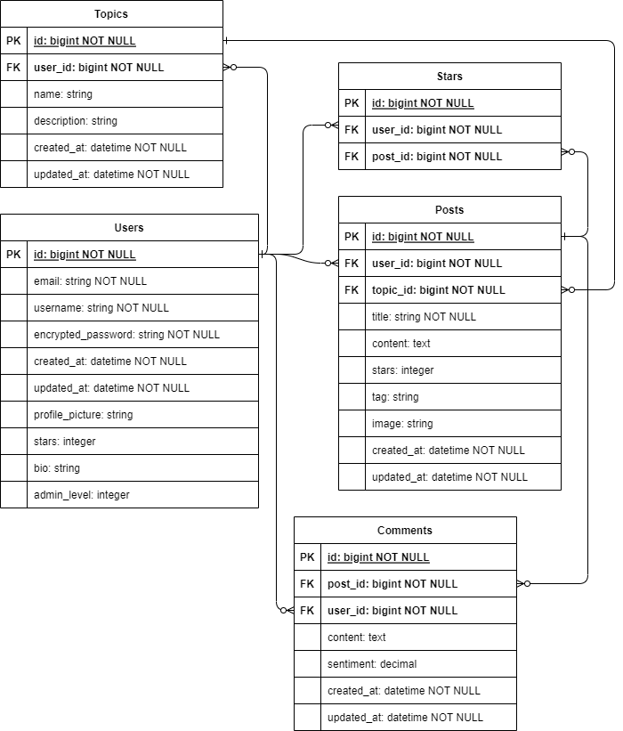

# CVWO Gossip with Rails 2022/23 Execution Plan

_This is an updated version as of 25 January 2023._&#x20;

__

### Web Forum Naming and Logo

The web forum will be named **Kaypoh.forum**, after the Singlish word kaypoh. The website logo is inspired by the Futhark rune, Ansuz ᚨ, the rune for speech and communication.

### User Story

As a web forum user ("**Community Member**"), I would like a user-friendly platform to create, update and delete posts that I wrote, sort and search for posts and comments, star or unstar posts, and update my user profile, so that I can effectively share my ideas and opinions on the forum, discuss them with other users, and search for information that is interesting to me.

As a web forum admin ("**Community Leader**"), I would like to easily create, update and delete topics, so that the forum topics stay up to date, and users can easily categorize their feed based on their interests.

### **Use Cases**

| Role  | Action                                 | Positive response                                                                                                     | Negative response                                  |
| ----- | -------------------------------------- | --------------------------------------------------------------------------------------------------------------------- | -------------------------------------------------- |
| User  | Sort and search for posts and comments | All posts/comments which fulfill the criteria given by the user is rendered.                                          | No error messages.                                 |
| User  | Create/ update a post                  | The post would be created/updated accordingly.                                                                        | Failure creating/ updating post. Error message.    |
| User  | Star/ unstar post                      | 1 star would be added/ subtracted from the post. This change would be reflected in the backend, then in the frontend. | No error messages.                                 |
| User  | Delete a post                          | The post, together with all comments which belongs to it, would be deleted.                                           | Failure deleting post. Error message.              |
| User  | Create/ update a comment               | The comment would be created/ updated accordingly.                                                                    | Failure creating/ updating comment. Error message. |
| User  | Deleting a comment                     | The comment would be deleted.                                                                                         | Failure deleting comment. Error message.           |
| User  | Update user profile                    | User profile data such as profile picture and bio can be updated.                                                     | Failure updating user profile. Error message.      |
| Admin | Create/ update a topic                 | A new topic is added. Users can now posts under the topic.                                                            | Failure creating/updating topic. Error message.    |
| Admin | Delete a topic                         | The topic, together with all posts (and comments that belongs to the post), would be deleted.                         | Failure deleting topic. Error message.             |

### Database Design

&#x20;The ER diagram of my web forum is as follows:

<figure><figcaption></figcaption></figure>

The following is the implementation of CRUD (Create, Read, Update, Delete) operations for this web forum:

|        | Users - Registrations | Users - Sessions | Topics          | Posts | Comments | Stars |
| ------ | --------------------- | ---------------- | --------------- | ----- | -------- | ----- |
| Create | ✅                     | ✅                | ✅ \[Admin only] | ✅     | ✅        | ✅     |
| Read   | ➖                     | ✅                | ✅               | ✅     | ✅        | ➖     |
| Update | ✅                     | ➖                | ✅ \[Admin only] | ✅     | ✅        | ➖     |
| Delete | ✅                     | ✅                | ✅ \[Admin only] | ✅     | ✅        | ✅     |

### Architecture and Tech Stack

The Frontend will be built using the Flux Architecture, with the following tech stack:&#x20;

* **TypeScript** for static typing, type inference, and project scalability
* **React** for interactive UI components
* **Redux** for centralized state management
* **MaterialUI** for customizable, component-based styling&#x20;

The Backend will be built using the Model–View–Controller (MVC) Architecture, with the Frontend as the View layer, with the following tech stack:

* **Ruby**, an object-oriented language with a focus on simplicity, elegance, and productivity
* **Rails**, which contains customizable structures for building APIs and database models.&#x20;
* **PostgreSQL**, a Relational Database Management System (RDBMS) which works well with Ruby on Rails and Docker, for data storage and maintenance.
* **Redis**, a key–value database, for caching.

### Reflection

Despite facing multiple challenges and bottlenecks when building the project, I truly enjoyed the learning process of this assignment. Although I had previously learned React through an online MOOC, I have no experience in Ruby on Rails and relational databases, and this is my first time developing and deploying a full-stack web application. I have learned and applied web development concepts such as route nesting, hooks, CORS, authentication, caching, and CDNs. While the structure of this project is not very complex when considering performance, scalability, security, and user experience, I have to find the best practices available, and sometimes tradeoffs have to be made.

Moving forward, these are some intended enhancements to the project in January 2023 and beyond:

1. Enhance documentation (adding comments and TypeDoc) and improve the structure of the project to increase readability ✅
2. Set up Docker development and production environments for the Frontend and Backend ✅
3. AWS: Deploy the API and Frontend on EC2, the PostgreSQL Database on RDS✅
4. Implement a rate-limiting feature for the API to reduce server load and increase security ✅
5. Use a Cron job to read RSS feed from major news sources, then bulk insert them as posts under the "News" topic ✅
6. Deploying the project as a Progressive Web App (PWA)&#x20;
7. Add a feature similar to Stories where users can choose to delete their posts after a certain time interval automatically. This can be implemented using a Cron job.
8. Enabling users to sign in using social media such as Google/Facebook
