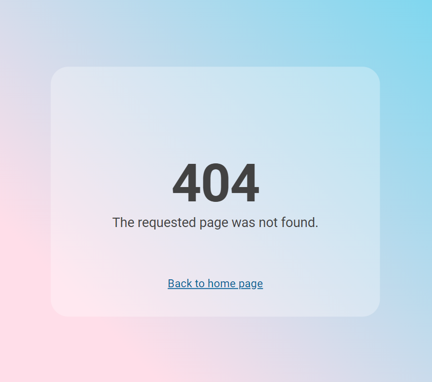

# General

#### Code of Conduct

Before you sign up, you are required to read and agree to the Citizen Code of Conduct of Kaypoh.forum:

<figure><figcaption></figcaption></figure>

#### 404 Not Found

If you enter an invalid route, you will see this page:

<figure><figcaption></figcaption></figure>

#### User authentication&#x20;

Every time you load a new page, the server verifies that you are still signed in. If you are not signed in or your JWT token has expired, you will be redirected to the **/login** page.

